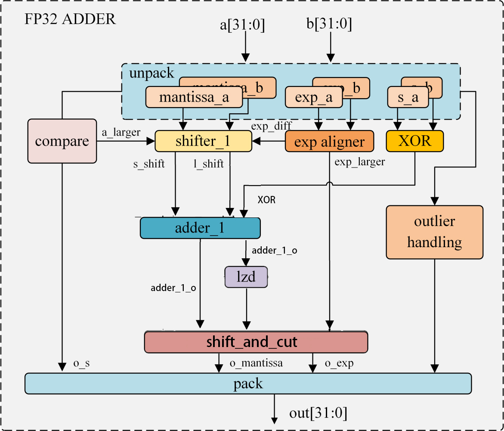
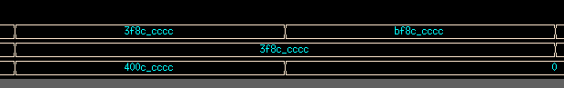
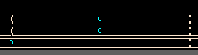
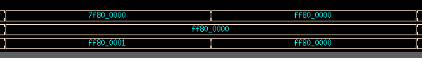
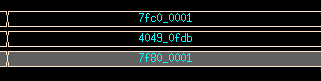
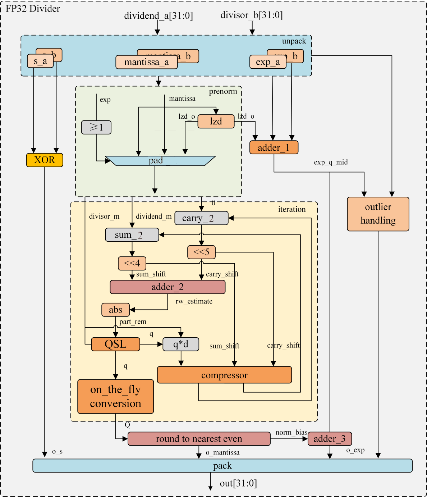

# 32-bit-Floating-Point-Adder
这个 Verilog 小项目基于linux系统的VCS仿真实现了一个符合IEEE 754 单精度浮点数标准（32 位）的浮点数加法器（FP32）的完整设计。该设计的目标是通过硬件描述语言（Verilog）实现一个能够处理两输入浮点数的加法运算模块。它包含了从输入数据的解析、异常值处理、对齐操作、加减法计算到结果归一化和输出包装的完整流程。以下是对代码功能和模块的详细介绍：

图1 FP32加法器架构图

各模块功能详情：

·unpack
        
    功能：将输入的FP32数分解为符号位（s）、指数（exp）和尾数（mantissa），并处理非规格化数。
    
    详细说明：分离符号位（1 bit，s_a与s_b）、指数（8 bit，exp_a与exp_b）和尾数（23 bit，mant_a与mant_b）。

·outlier handling

        功能：处理异常值

        详细说明：根据unpack的结果判断输入是否为异常值如NaN、无穷大、零输出为一位的adn和两位的state。
        若检测到异常，将输出adn置1，直接输出32位FP32结果：若两数均为零，输出state为00，返回零；
        若两数均为无穷大且符号相同，输出state为01，返回该无穷大，符号不同，输出state为10，返回NaN任一输入为NaN，输出state为11，返回NaN。

·compare

        功能：比较两输入数的大小，确定对齐策略。

        详细说明：根据unpack的结果指数（8 bit）和尾数（24 bit）比较输入绝对值的大小。先比较阶码的大小，若相等，再进一步比较尾数大小。
        若尾数还是相等的，将输出值same置1。输出结果a_larger（1 bit）s_o（1 bit，绝对值较大的输入的符号位）same（1bit，判断是否相等）。

·exp_aligner

        功能：负责指数对齐，并计算差值exp_diff = |exp_a - exp_b|。
        
        详细说明：输出较大的指数exp_larger （8 bit）作为中间结果的指数，
        根据两指数大小计算exp_a - exp_b 或 exp_b - exp_a 得到exp_diff 输出（8bit）。

·shifter_1

        功能：将尾数右移对齐。

        详细说明：将mant_a， mant_b，低位补0（25bit） 扩充到48bit，若输入的same值为0，
        则根据输入a_larger选择较小的数，将其右移exp_diff 位，得到s_shift（48bit），
        较大的数右移一位空出符号位，输出结果l_shift（48bit）。
        若输入的same值为一，则直接输出结果l_shift（48bit），s_shift（48bit）。

·XOR

        功能：执行异或操作

        详细说明：对输入两个符号位s_a和s_b执行异或操作，判断符号位是否不同。
        如果不同，则实际操作为尾数的减法，输出值XOR为1’b1；如果相同，则为加法，输出值XOR为1’b0。

·adder_1

        功能：执行48位加法操作
        
        详细说明：输入l_shift，s_shift，若输入的XOR为1则执行加法，
        若输入的XOR为0，则将s_shift取反并加一，执行减法操作，输出48bit加法结果adder_1_o

·LZD（Leading Zero Detector）

        功能：对adder_1_o进行前导零检测。

        详细说明：输入为adder_1_o（48bit），输出为adder_1_o结果最高位的1前0的个数lzd_o（8bit）

·shift_and_cut

        功能：对结果进行移位与剪切，输出尾数与阶码。

        详细说明：正常情况下使adder_1_o左移lzd_o，输入到num_sh（48bit）中，并使exp_o（8bit）等于exp_larger减去（lzd_o-1）。
        特殊情况需考虑：lzd为0，代表有进位，adder_1_o直接等于num_sh，指数位exp_o = exp_larger + 1；
        若exp_larger<lzd，输出可能是非规格化数，adder_1_o左移exp_larger作为num_sh，
        此时若num_sh最高位为1，exp_o为1，num_sh最高位为0，exp_o为0；若输入的adder_1_o为零，则直接使exp_o等于零。
        最后使用就近舍入到偶数的规则（IEEE 754默认的舍入模式）,将num_sh舍入到23位尾数。
        若要舍去的数组元素中的最高位为1，则舍入尾数使其加1，如舍入操作使尾数溢出，则使指数加1。
        模块输出舍入后结果输出为mant_o（23 bit），exp_o（8bit）。

·pack模块

        功能：打包为fp32格式。

        详细说明：若输入的adn为0，说明如输入不为异常值，则将符号s_o、指数exp_o、尾数mant_o组合为FP32格式；
        若输入的adn为1，说明输入为异常值，无视s_o、exp_o与mant_o，直接输出Outlier Handling的结果。

最后进行仿真，先在sim文件夹中执行make sim命令进行编译，再执行make verdi命令进行仿真，以下为在linux系统中进行VCS仿真的波形图，从上到下依次为输入值a、b和输出answer：

输入两个1.1时输出32’h400ccccc，即2.2，输入为-1.1与1.1时输出为0。

输入两个0时输出为0。

分别输入异号无穷和同号无穷时，分别输出NaN与无穷。

输入中存在NaN时，输出NaN。

# 32-bit-Floating-Point-divider
接下来是对除法器模块的介绍，它同样包含了从输入数据的解析、异常值处理、尾数预处理、利用SRT算法迭代计算商到结果归一化和输出包装的完整流程。以下是对代码功能和模块的详细介绍：

图6 FP32除法器架构图

各模块功能详解：

·unpack

        功能：将输入的FP32数分解为符号位（s）、指数（exp）和尾数（mantissa），并处理非规格化数。
        
        详细说明：分离符号位（1 bit）、指数（8 bit）和尾数（23 bit）。
        若指数为0，则为非规格化数，隐含位为0；否则隐含位为1，扩展尾数为24位（1.M或0.M）。

·XOR

        功能：执行异或操作
        
        详细说明：对输入两个符号位s_a和s_b执行异或操作，判断符号位是否不同。
        如果不同，则实际结果为负数，符号位输出1’b1；如果相同，则为实际结果为正数，符号位输出1’b0。

·prenorm

        功能：根据unpack的结果对尾数进行预处理。
        
        详细说明：
        
        1)对exp_a，exp_b进行自或判断输入数据是否为非规格化数，自或结果为0代表是非规格化数（输入为0在outlier handling直接进行处理）。
        
        2)规格化数补充隐藏1，规格化数最高位补0。非规格化数对24bit补0结果使用lzd模块进行前导零检测，
        得到lzd_o_a或lzd_o_b（5bit），将非规格化数的24bit左移lzd_o_a或lzd_o_b（5bit）得到shift_a或shift_b（24bit）。
        
        3)Pad模块对数据进行位宽扩展，对于被除数dividend_m = {7’b0, shift_a, 4’b0};对于除数divisor_m = {shift_b,6’b0};

·adder_1

        功能：计算指数中间结果
        
        详细说明：exp_mid = (exp_a - exp_b) + 127 - lzd_o_a-lzd_o_b。exp_mid位宽为10bit，1bit符号位。

·outlier handling

        功能：处理异常值
        详细说明：根据unpack的结果判断输入是否为异常值如NaN、无穷大、零输出为一位的adn和两位的state。
        若检测到异常，将输出adn置1，直接输出32位FP32结果：
        任一输入为NaN，返回NaN；除数为0，输出NaN; 输入均为无穷大，输出NaN;
        输入为0和无穷大，输出NaN;被除数为0，除数为非异常值，输出0。

·iteration

        功能：迭代计算尾数的商
        
        详细说明：
        
        1)sum_2，carry_2均为寄存器，第一次迭代周期初始化sum_shift = dividend_m<<4；carry_reg = 0;
        
        2)adder_2取sum_shift和carry_shift高14bit相加，得到rw_estimate（14bit，最高位为符号位)
        
        3)Abs模块根据rw_estimate最高位求得rw_estimate绝对值。
        得到用于查表的部分余数part_rem = rw_estimate[13] ? ~rw_estimate[13:2]: rw_estimate[13:2]; Part_rem为12bit
        
        4)QSL 使用part_rem和divisor_m高位7bit进行查表得到4bit商q∈{-9，-8，...，8，9}
        
        5)on_the_fly conversion实时将基16的冗余商数字转换为标准二进制形式，避免最终阶段的复杂转换延迟，从而优化硬件效率和计算速度。
        具体来说，硬件中计算两个寄存器：Qreg：二进制商拼接结果；Q_minus：q-1（用于处理向高位借1的情况）。
        冗余商qj+1为正数时，Qreg=Q×16+qj+1；
        Qminus_new=Q×16+(qj+1-1)；
        冗余商qj+1为负数时，Qreg=Qminus×16+(16+qj+1)；(借位补偿)
        Qminus_new=Qminus×16+(16+qj+1-1)；
        Q和Q_minus均为32bit，即需要迭代8个周期
        
        6)q*d使用移位加法器计算
        将q的绝对值拆解为数个4、2、1的和，1个d不需移位，2个d移一位，4个d移两位： 
        r1_d[34:0] = {5'b0,divisor_m};
        r2_d[34:0] = {4'b0,divisor_m,1'b0};
        r4_d[34:0] = {3'b0,divisor_m,2'b0};
        r8_d[34:0] = {3'b0,divisor_m,2'b0};
        q = -5时，q为负数，-qd 为正数数值是-q*d的结果就是：
        r1_d[34:0] + r4_d[34:0] （可以将r1_d，和r4_d都送进保留compressor）
        
        7)compressor使用进位保留加法器（5输入，q*d给三输入），减小操作数。对于五输入操作数a,b,c,d,e先执行
        Sum_1 = a ^ b ^ c ^ d;
        carry_1 = (a & b) | ((a | b) & c) | ((a | b | c) & d);
        所有输入和输出都是35bit，4个操作数变成两个，再进行
        Sum_2 = Sum_1 ^ (carry_1 << 1) ^ e;
        carry_2 = (Sum_1 & (carry_1 << 1)) | ((Sum_1 | (carry_1 << 1)) & e); 
        输出结果Sum_2，carry_2 均为35bit，使sum_shift=sum_2<<4和carry_shift=carry_2<<5。

        在迭代计算完成后，输出Q

·Round to Nearest Even

        功能：进行舍入
        
        详细说明：输入exp_q_mid（10bit 含符号位）和Q（32bit），使用就近舍入到偶数的规则（IEEE 754默认的舍入模式）。
        将Q舍入到23位尾数mant_o。Q的最高位为整数位，据此判断是否需要左移：
        Q[31]为1，norm_bias = 1；Q[31]为0，Q左移1bit，norm_bias = 0。
        此处不需要进行前导零检测，因为规格化后，1.m/ 1.n 的结果位于(0.5, 2）根据舍入情况exp_q_mid+norm_bias，截取后8bit作为exp_o输出。

·Pack

        功能：打包为fp32格式
        
        详细说明：将符号s_o、指数exp_o、尾数mantissa_o组合为FP32格式；若输入为异常值，输出Outlier Handling的结果。
